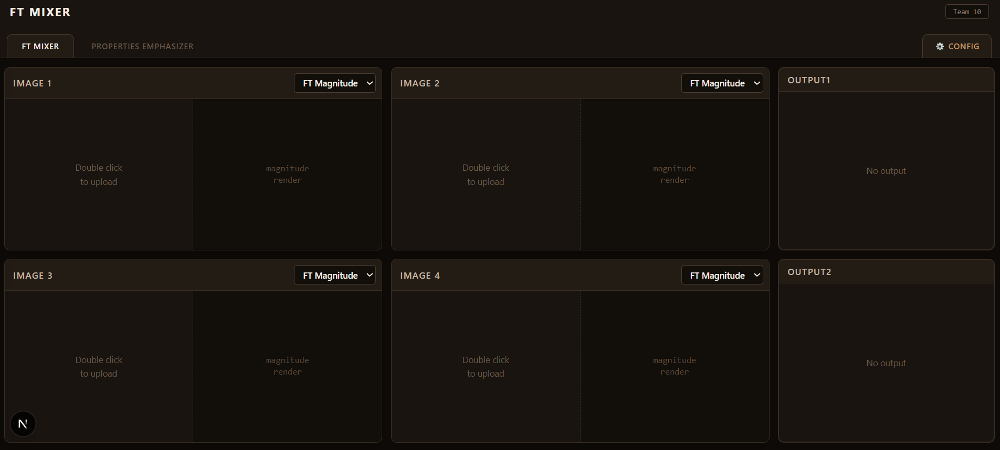
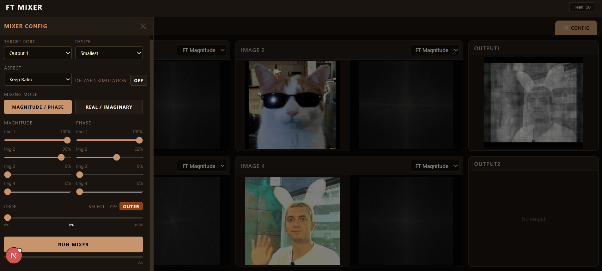
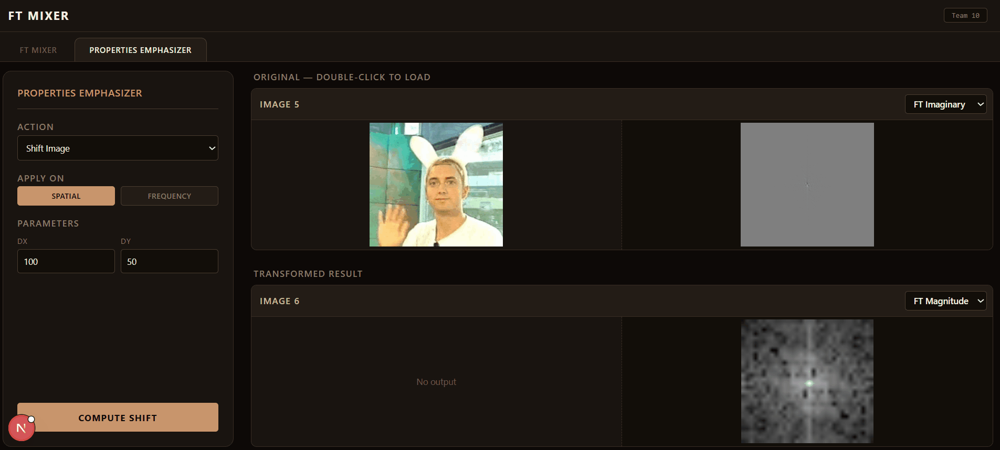
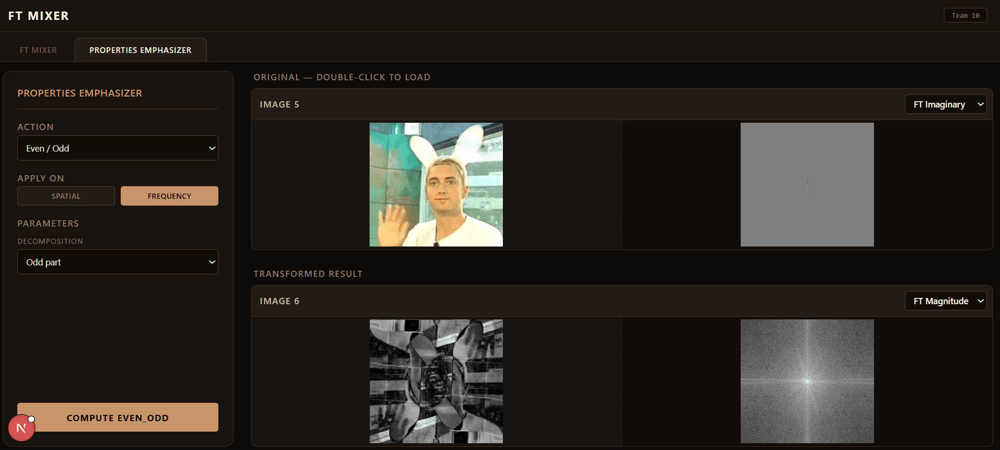

# 🌊 Fourier Transform Mixer & Properties Emphasizer

<div align="center">


**An interactive web platform for exploring 2D Fourier Transform concepts through visual mixing and property demonstration.**

*DSP Task 3 | Cairo University, Biomedical Engineering*

</div>

---

## 📽️ Full Application Demo

<div align="center">



</div>

---

## 📋 Table of Contents

- [Overview](#overview)
- [Part A — FT Mixer](#part-a--ft-magnitudephase-mixer)
- [Part B — Properties Emphasizer](#part-b--ft-properties-emphasizer)
- [How to Run](#how-to-run)
- [Technologies](#technologies)
- [Contributors](#contributors)

---

## Overview

This project is a web-based interactive platform for exploring **Fourier Transform concepts on 2D signals (images)** through two main modes:

- **FT Magnitude/Phase Mixer** — mix Fourier components from multiple images and reconstruct the output
- **FT Properties Emphasizer** — visually demonstrate classical FT properties in both spatial and frequency domains

The application covers **magnitude**, **phase**, **real**, and **imaginary** Fourier components, and shows how operations in one domain affect the other — making abstract DSP concepts tangible and visual.

---

## Part A — FT Magnitude/Phase Mixer

<div align="center">



</div>

### Features

**Image Viewers**
- Load and view up to **four images** simultaneously, each in its own viewport
- Unified image sizing with configurable resize policies (smallest / largest / fixed size, with aspect ratio control)
- Double-click any viewport to browse and replace its image
- For each image, toggle between viewing: **FT Magnitude**, **FT Phase**, **FT Real**, **FT Imaginary**
- Adjust **brightness and contrast** interactively via mouse drag on any viewport or component

**Components Mixer**
- Output is the IFFT of a weighted average of the four input image FTs
- Control each image's contribution weight via **sliders**
- Mix modes: **Magnitude + Phase** or **Real + Imaginary**
- Display result in either of **two output viewports**

**Region Mixer**

<div align="center">


</div>

- Draw a rectangle on the Fourier plane to select a frequency region
- Choose **inner region** (low frequencies) or **outer region** (high frequencies)
- Selected region is highlighted with a semi-transparent overlay
- Region size is adjustable via slider or resize handles
- Region selection is unified across all four images

**Realtime Mixing**
- Progress indicator shown during IFFT computation
- If settings change mid-operation, the previous thread is cancelled and the new request starts immediately
- Optional simulated bottleneck mode available in settings for testing thread behavior on fast machines

---

## Part B — FT Properties Emphasizer

<div align="center">




</div>

### Interface

The emphasizer provides four synchronized viewports:
- **Original spatial image** — the input
- **Transformed spatial image** — after applying the selected operation
- **Original FT** — frequency domain of the input
- **Transformed FT** — frequency domain after the operation

Each viewport supports switching between **Magnitude / Phase / Real / Imaginary** display. Operations can be applied in either the spatial domain or the frequency domain — the opposite domain updates instantly.

---

### Demonstrated Properties

#### 1. Shift
Shifts the image spatially in any direction (up/down, left/right).
**FT effect:** magnitude is preserved; phase changes — demonstrating that **phase encodes positional information**.

#### 2. Multiply by Complex Exponential
Multiplies the image by a user-configurable complex exponential term.
**FT effect:** produces a controlled frequency-domain shift, illustrating the **modulation ↔ translation duality**.

#### 3. Stretch
Expands or compresses image dimensions by an integer or fractional factor.
**FT effect:** stretching in one domain causes **inverse scaling** in the other.

#### 4. Mirror
Reflects the image around a chosen axis by duplication.
**FT effect:** introduces geometric symmetry into the spectral representation.

#### 5. Even / Odd Construction
Duplicates the image to make it globally even or odd around its center.
**FT effect:** even symmetry produces **real-valued** FT behavior; odd symmetry emphasizes the **imaginary component**.

#### 6. Rotation
Rotates the image by any integer angle from 0° to 360°. Canvas is enlarged to preserve all image content.
**FT effect:** the Fourier representation **rotates by the same angle** — one of the clearest geometric FT properties.

#### 7. Differentiate
Emphasizes rapid intensity changes and edges in the image.
**FT effect:** amplifies **high frequencies**, making fine details and transitions more visually dominant.

#### 8. Integrate
Accumulates image values, smoothing rapid variation.
**FT effect:** suppresses **high frequencies** relative to low ones, producing a smoother appearance.

#### 9. Windowing
Multiplies the image by a 2D window function with fully configurable parameters.
Supported windows: **Rectangular**, **Gaussian**, **Hamming**, **Hanning**.
**FT effect:** multiplication in one domain corresponds to **convolution** in the other — illustrating spectral shaping and leakage control.

#### 10. Repeated Fourier Transform
Applies the Fourier Transform multiple times in sequence (user-configurable count), on top of any of the above operations.
**FT effect:** repeated applications produce predictable transformations, eventually cycling back through flipped and structured forms of the original image.

---

## How to Run

### Prerequisites
- Python 3.10+
- Node.js 18+

### Backend
```bash
cd backend
pip install -r requirements.txt
uvicorn main:app --reload
```

### Frontend
```bash
cd frontend
npm install
npm run dev
```

Then open [http://localhost:3000](http://localhost:3000) in your browser.

---

## Why Magnitude and Phase Matter

One of the central insights of this project:

- **Magnitude** controls how strong each frequency component is
- **Phase** controls how those components align structurally in the image

In reconstruction, phase often carries the majority of structural information, while magnitude governs intensity distribution. The mixer and properties modes together make this visible and interactive.

---

## Technologies

| Layer | Stack |
|---|---|
| Frontend | Next.js, React, JavaScript |
| Backend | Python, FastAPI |
| Processing | NumPy, 2D FFT/IFFT |
| Concepts | Magnitude/Phase decomposition, frequency-region masking, spatial-frequency duality |

---

## Project Structure

```
ft-mixer-properties-emphasizer/
├── backend/
├── frontend/
│   └── public/
│       └── docs/
│           └── gifs/
│               ├── full_demo.gif
│               ├── mixer_overview_1.gif
│               ├── region_mixer.gif
│               └── properties_overview.gif
├── .gitignore
└── README.md
```

---

## Contributors

<div align="center">

<table>
  <tr>
    <td align="center">
      <a href="https://github.com/hamdy-fathi">
        <br/>
        <sub><b>Hamdy Ahmed</b></sub>
      </a>
    </td>
    <td align="center">
      <a href="https://github.com/OmegasHyper">
        <br/>
        <sub><b>Mohamed Abdelrazek</b></sub>
      </a>
    </td>
    <td align="center">
      <a href="https://github.com/Chron1c-24">
        <br/>
        <sub><b>Yousef Samy</b></sub>
      </a>
    </td>
    <td align="center">
      <a href="https://github.com/YomnaSabry172">
        <br/>
        <sub><b>Youmna Sabry</b></sub>
      </a>
    </td>
  </tr>
</table>

</div>
